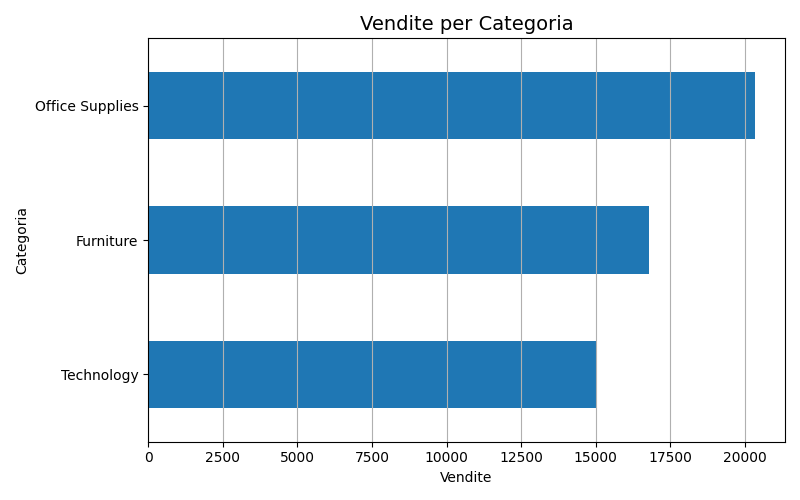
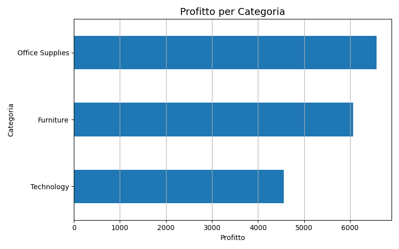
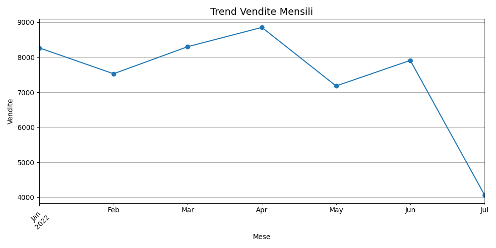

# 📊 Sales Data Analysis

## 📌 Overview

This project analyzes sales data to identify trends, profitability, and business opportunities using Python.

## 🛠️ Tools Used

* Python (pandas, matplotlib)
* Jupyter Notebook

## 📊 Analysis Performed

* Total revenue calculation
* Sales by category
* Profitability analysis
* Monthly sales trends

## 📊 Visualizations

## 🔍 Key Insights

* High sales do not always correspond to high profit
* Some categories generate more revenue but lower margins
* Sales show variability over time, suggesting possible seasonality

## 💡 Business Recommendations

* Focus on high-margin products
* Improve or optimize low-profit categories
* Use data-driven strategies for decision making

## 📁 Project Structure

* `analysis.ipynb` → main analysis
* `superstore_sample.csv` → dataset
* `images/` → visualizations

## 🚀 Outcome

This project demonstrates skills in data cleaning, analysis, visualization, and business thinking.
